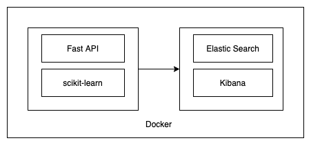

# Toy Model
[](https://circleci.com/gh/ericvenarusso/toy_model/tree/main)

## Conteúdo
1. [Como executar](#installation)
2. [Motivação do Projeto](#motivation)
3. [Arquitetura](#arquitecture)
4. [Licensa, Autores, e Agradecimentos](#licensing)

## Como executar <a name="installation"></a>
Este código é executado utilizando Docker Compose, caso você não tenha instalado em sua maquina você pode instalar seguindo esses passos:
* https://docs.docker.com/get-docker/
* https://docs.docker.com/compose/

Para executar o projeto você deve executar o seguinte comando.

```console
$ docker compose up --build
```

Endereço dos serviços
* API
    * Predict: http://localhost:8000/api/model/predict
    * Swagger: http://localhost:8000/docs
* Kibana: http://localhost:5601/

Para parar a execução do projeto você deve executar o seguinte comando.

```console
$ docker compose down
```

## Motivação do Projeto <a name="motivation"></a>
Esse projeto tem como objetivo ser uma forma de aprender novas tecnologias na área de MLOps, para isso foi construido um modelo de Machine Learning bem simples usando o Dataset do Titanic.

## Arquitetura <a name="arquitecture"></a>


### Stack Tecnologica
* Python 3.8
* sckit-learn
* Fast API
* Docker
* Elastic(Search, Kibana)

## Licensa, Autores, e Agradecimentos <a name="licensing"></a>
Eric Buzato Venaruso@2021